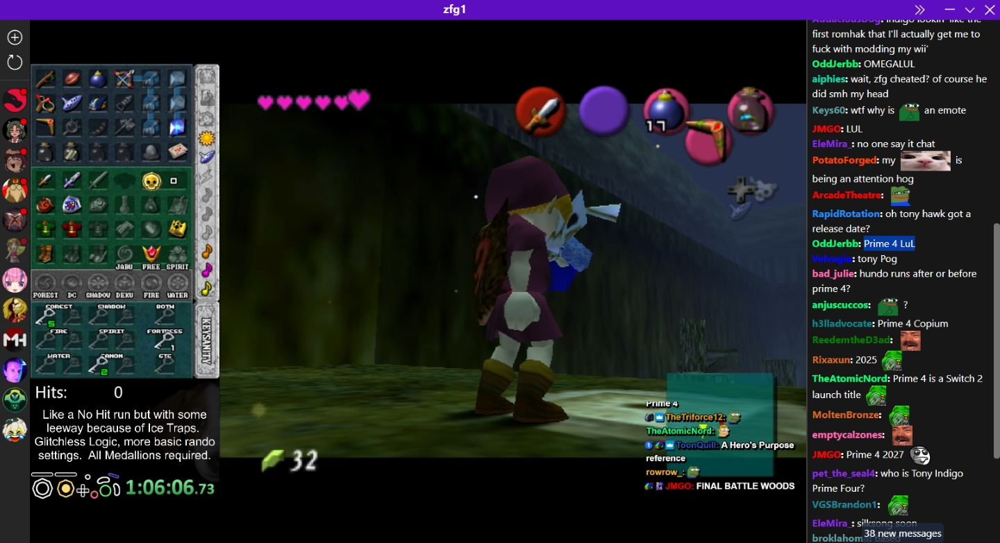
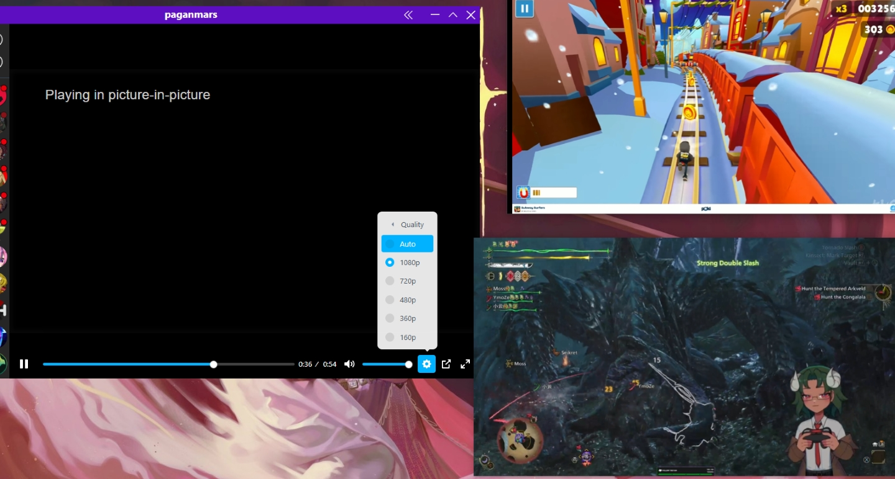

# RT (name pending)

> [!NOTE]
> I am currently working on a port to Electron, I will go into more details about it once it reaches parity with the current version.

A Twitch and YouTube frontend written in Rust using Tauri and SvelteKit.

<table>
    <tr>
        <td align="center">
            
            <em>
                <div>
                    <a href="https://www.twitch.tv/zfg1">zfg1</a> playing OOT. Chat on Copium for Prime 4.
                </div>
            </em>
        </td>
        <td align="center">
            
            <em>
                <div>
                    <a href="https://www.twitch.tv/paganmars">paganmars</a> playing Monster Hunter Wilds. An excelent use of screen space with PiP.
                </div>
            </em>
        </td>
    </tr>
</table>

> Very old screenshots.

## Features

- Import YouTube subscriptions. (Accepts a `csv` file separated by Channel ID, URL, Title)
- Add users to your stream and videos feeds.
- Watch content in any of the available resolutions.
- View Twitch chat with 7tv and BetterTTV emotes.
- Block ads.
- Open videos or streams directly in the app using `rt:://` URLs.

## Download

> All installers (`exe`, `deb`, `rpm`) are provided in a small zip file.

[Quick download.](https://nightly.link/Kyagara/rt/workflows/build.yaml/main/bundles.zip) (does not require GitHub account).

Github Actions builds are available [here](https://github.com/Kyagara/rt/actions).

## About

Tested on Windows and Ubuntu. Not tested on macOS as I don't have access to a macOS machine, if you manage to build and test it, please let me know and I will work on fixing issues and adding it to the build bundles.

### Redirects

On launch, a custom protocol handler is registered for `rt://` URLs, this allows you to open videos or streams directly in the app.

If the app is not running, it will be started with the URL as an argument, if it is running, the URL will be opened in a new window.

`YouTube`:

- `rt://yt/dQw4w9WgXcQ`
- `rt://youtube/dQw4w9WgXcQ`
- `rt://www.youtube.com/watch?v=dQw4w9WgXcQ`
- `rt://youtu.be/dQw4w9WgXcQ`

`Twitch`:

- `rt://tw/zfg1`
- `rt://twitch/zfg1`
- `rt://www.twitch.tv/zfg1`

If you are using extensions like [LibRedirect](https://github.com/libredirect/browser_extension), you can set a frontend for YouTube like Invidious and set the instance URL to `rt://`. The same can be done for Twitch, you can set the frontend to SafeTwitch and set the instance URL to `rt://`.

### Paths

To store users, feeds and emotes, SQLite is used with [sqlx](https://crates.io/crates/sqlx).

Data (databases, window state, etc):

- Windows: `%AppData%/com.rt.app`
- Linux: `~/.config/com.rt.app`

Logs:

- Windows: `%LocalAppData%/com.rt.app/logs`
- Linux: `$XDG_DATA_HOME/com.rt.app/logs` or `$HOME/.local/share/com.rt.app/logs`

### Frontends

`YouTube`:  

The feed uses YouTube's rss feed to retrieve videos to avoid rate limits, this sadly does not contain video duration.

Using the excellent [RustyPipe](https://crates.io/crates/rustypipe) library to interact with YouTube, its recommended to install [rustypipe-botguard](https://crates.io/crates/rustypipe-botguard) to use a YouTube player instead of the embedded one.

```bash
cargo install rustypipe-botguard
```

The watch page will try to use RustyPipe to retrieve a YouTube player, if it fails, it will use Vidstack's YouTube [provider](https://vidstack.io/docs/player/api/providers/youtube/) to play videos via embeds, this fallback has the drawbacks of not being able to play videos that disallows embedding and not being able to select a video quality. You have the option to switch between them in the Watch page.

The player currently doesn't show the quality selection correctly, as there are multiple codecs for the same quality, which will show duplicates.

`Twitch`:

The player uses a custom [hls.js](https://github.com/video-dev/hls.js/) loader that communicates with the backend to retrieve and modify the m3u8 manifests, this is what allows for ad blocking as the backend can detect ads and switch to a backup stream until ads are over, this was inspired by [TwitchAdSolutions](https://github.com/pixeltris/TwitchAdSolutions) method of switching streams.

The backend uses GQL queries from the internal Twitch API to retrieve user data and stream playback.

## TODO

- Update screenshots.
- Add information about the content somewhere in the watch page.
- Maybe make a custom player layout using tailwind.
- YouTube:
  - Add YouTube channel page with video search.
  - Allow downloading videos and thumbnails.
  - Search for videos in the feed.
  - Properly handle links in the description.
  - Fix mute/volume not working in the `player-settings` local storage.
- Twitch:
  - It seems there are issues with the `avif` format in emotes in Linux, maybe use `webp` or `png` instead.
  - Put the seek bar at the end when joining a stream, currently it is some seconds behind when first joining.
  - Add global Twitch emotes.
