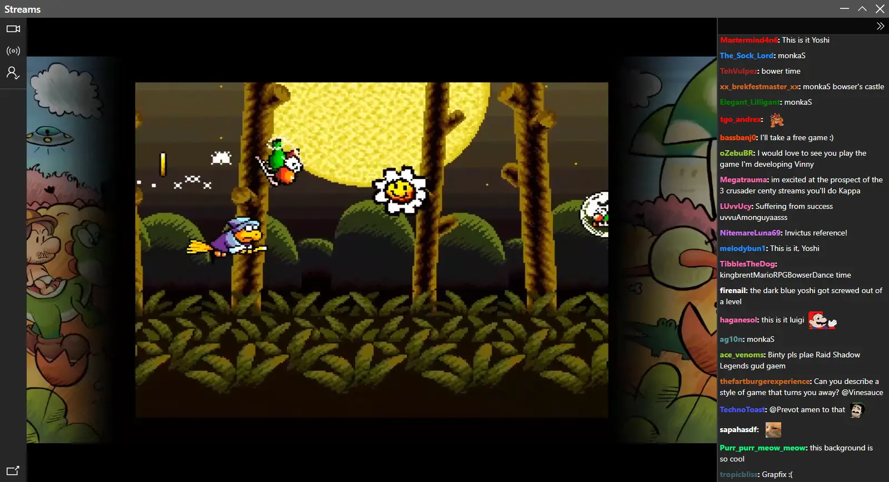
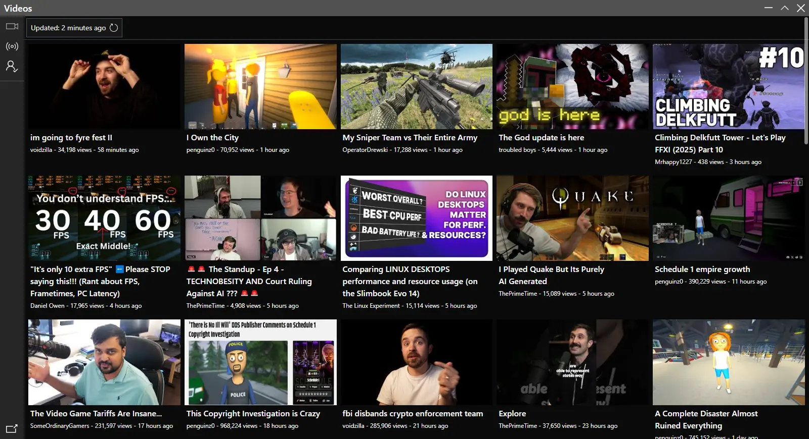

# RT (name pending)

> [!WARNING]
> WIP! YouTube videos will run into 403 after some time, embedded videos are used by default for now.

A Twitch and YouTube frontend app using Svelte and Electron.

<table>
    <tr>
        <td align="center">
            
            <em>
                

                    <a href="https://www.twitch.tv/vinesauce">vinesauce</a> playing Yoshi's Island.
                

            </em>
        </td>
        <td align="center">
            
            <em>
                

                    YouTube feed with videos and streams.
                

            </em>
        </td>
    </tr>
</table>

## Features

- Import YouTube subscriptions. (Accepts a `csv` file separated by Channel ID, URL, Title)
- Add users to your stream and videos feeds.
- Watch content in any of the available resolutions.
- View Twitch chat with 7tv and BetterTTV emotes.
- Block ads.
- Open videos or streams directly in the app using `rt://` URLs.
- Picture-in-picture (except for embedded videos).

## About

Tested on Windows and Ubuntu. Not tested on macOS.

### Download

> These are files from the latest successful build, they do not require a GitHub account to download.

- [Windows](https://nightly.link/Kyagara/rt/workflows/build.yaml/main/windows.zip)
- [Linux](https://nightly.link/Kyagara/rt/workflows/build.yaml/main/linux.zip)
- [macOS](https://nightly.link/Kyagara/rt/workflows/build.yaml/main/mac.zip)

You can check for possible older artifacts [here](https://github.com/Kyagara/rt/actions).

### Redirects

On launch, a custom protocol handler is registered for `rt://` URLs, this allows you to open videos or streams directly in the app.

If the app is not running, it will be started with the URL as an argument, if it is running, the URL will be opened in a new window.

`YouTube`:

- `rt://yt/{VIDEO_ID}`
- `rt://youtube/{VIDEO_ID}`
- `rt://www.youtube.com/watch?v={VIDEO_ID}`
- `rt://youtu.be/{VIDEO_ID}`

`Twitch`:

- `rt://tw/{CHANNEL_NAME}`
- `rt://twitch/{CHANNEL_NAME}`
- `rt://www.twitch.tv/{CHANNEL_NAME}`

If you are using extensions like [LibRedirect](https://github.com/libredirect/browser_extension), you can set a frontend for YouTube like Invidious and set the instance URL to `rt://`. The same can be done for Twitch, you can set the frontend to SafeTwitch and set the instance URL to `rt://`.

### Paths

To store users, feeds and emotes, SQLite is used with [better-sqlite3](https://github.com/WiseLibs/better-sqlite3).

Data (databases, window state, etc) and logs:

- Windows: `%AppData%/com.rt.app`
- Linux: `~/.config/com.rt.app`

### Frontends

`YouTube`:  

The feed uses YouTube's rss feed to retrieve videos to avoid rate limits, this sadly does not contain video duration.

The watch page will try to retrieve a YouTube player using [YouTube.js](https://github.com/LuanRT/YouTube.js), if it fails, it will use Vidstack's YouTube [provider](https://vidstack.io/docs/player/api/providers/youtube/) to play videos via embeds, this fallback has the drawbacks of not being able to play videos that disallows embedding and not being able to select a video quality. You have the option to switch between them.

`Twitch`:

The player uses a custom [hls.js](https://github.com/video-dev/hls.js/) loader that fetches and reads the playlists, this is what allows for ad blocking as the loader can detect ads and switch to a backup stream until ads are over, this was inspired by [TwitchAdSolutions](https://github.com/pixeltris/TwitchAdSolutions) method of switching streams.

Uses GQL queries from the internal Twitch API to retrieve user data and stream playback.

## TODO

- Tweak tsconfig and maybe add some more linting.
- Themes.
- Error handling.
- Logging.
- Maybe move to using classes.
- Maybe build just flatpak for Linux.
- YouTube:
  - Improve descriptions, links are not formatted properly and has a lot of extra lines.
  - Maybe add tabs for livestreams and shorts in the feed.
  - Buttons for downloading videos (maybe using `yt-dlp`) and thumbnails.
  - YouTube channel page with all videos/shorts/livestreams with pagination.
  - Input field in feed and page for searching videos/channels.
